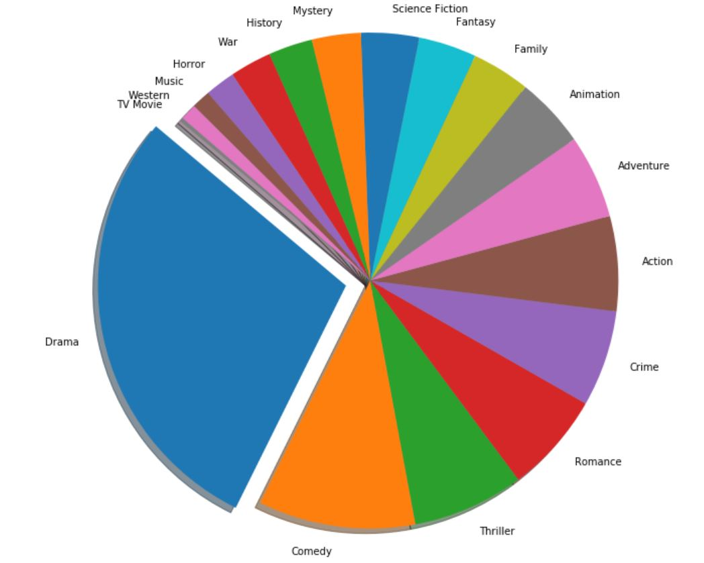
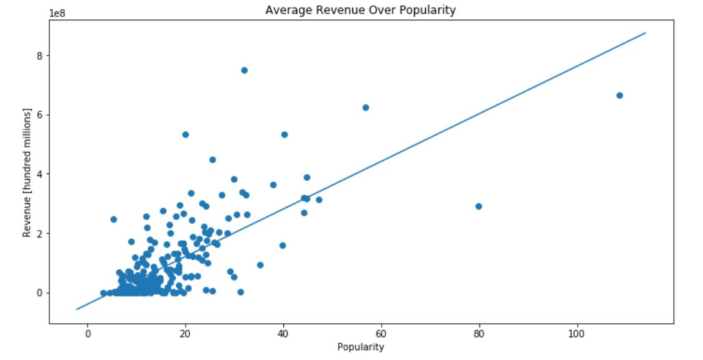
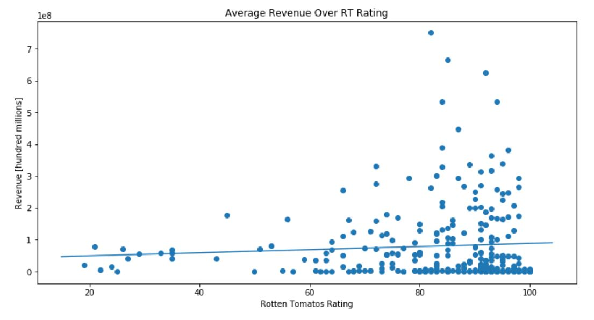
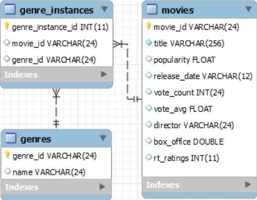

# Blockbusters

## Goal:
Gain insight into current trends in the movie making industry.  

## Data Sources:
__TMDb__:  The majority of data collection has revovled around The Movie Database site. Using TMDb we gathered a list of the top 1000 movies ever created.

__OMDb__: Supplemental data has been acquired from the Open Movies DB for the 1000 titles that were extracted from TMDb.

| Data                   | Source |
| ---------------------- | ------ |
| Title                  | TMDb   |
| Realase Date           | TMDb   |
| Genre                  | TMDb   |
| Popularity             | TMDb   |
| Vote Count             | TMDb   |
| Vote Average           | TMDb   |
| Director               | OMDb   |
| Revenues               | OMDb   |
| Rotten Tomatoes Rating | OMDb   |

## Technical Description:

In order to complete our goal we utilized [Amazon Web Services](https://aws.amazon.com/ "Amazon Web Services") (AWS RDS) and initiated a database  instance to store all the data we gathered. To increase collaboration efficiency we used [GitHub](https://github.com/ "GitHub"); this allowed us to work uninterrupted, simultaneously, and independently.

The majority of our code was written in Jupyter Notebooks using Python. Furthermore, we used [VSCode](https://code.visualstudio.com/ "VSCode") to create 4 Python modules that contain all the functions we created. Additionaly, we used MySQL queries to interact with our AWS-RDS.

# Methodology

## Define Success

Definition: "the attainment of popularity or profit".

We defined success by focusing mainly on popularity. Followed by raising questions such as:

1. Are some genres more popular than others?
2. Which directors create the most popular movies?
3. Which movie genre creates the most revenue?

## Workflow

* Create AWS RDS Instance
* Create [DB Schema](#DB-Schema)
* Populate Tables
  * Gather data using [OMDb's](http://www.omdbapi.com/ "OMDb") and [TMDb's](https://www.themoviedb.org/?language=en-US "TMDb") own APIs
  * Clean data using Python to extract only what we might need.
* Data Analyses
  * Extract the relevent data using MySQL queries
  * Create visuals using [Matplotlib](https://matplotlib.org/ "Matplotlib")
  
## Results

We started out by looking at the distribution of genres within the top rated movies in TMDb.

Before we dove deeper into more analyses we first tested the different rating metrics that were available to us (rotten tomatoes rating and TMDB's popularity) with the box office revenues to check with one correlated better. Popularity seemed to correlate more with the average revenues (r=0.73489501) than rotten tomatoes rating (r=0.06660523)

 

#### DB-Schema
